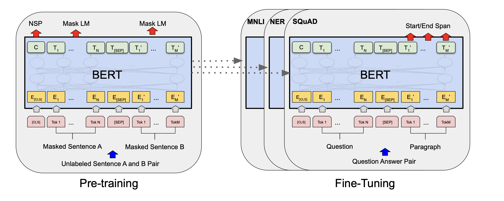
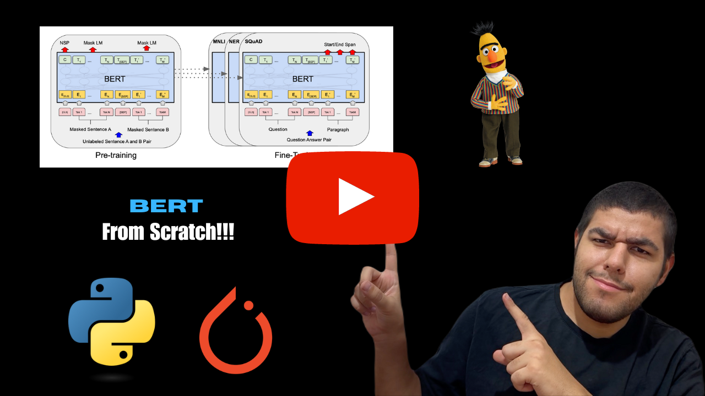

# BERT (Bidirectional Encoder Representations from Transformers) Implementation With PyTorch

<div align="center">
    <a href="">
        
    </a>
</div>
<br/>
<div align="center">
    <p>Liked our work? give us a ⭐!</p>
</div>

<p align="center">
  
</p>

This repository contains minimalistic implementation of BERT (Bidirectional Encoder Representations from Transformers) that is introduced in the paper [BERT: Pre-training of Deep Bidirectional Transformers for Language Understanding](https://arxiv.org/pdf/1810.04805) using PyTorch. 

### YouTube Tutorial
This repository also contains a corresponding YouTube tutorial with the title **Implement BERT From Scratch - PyTorch**

[](https://www.youtube.com/watch?v=v5cyVwAXR1I&t=9s)

## Table of Contents
* [BERT Implementation](#vitimp)
    * [BERT](#bert)
    * [BERTEmbedding](#embed)
* [Usage](#usage)
* [Contact](#contact)

## ViT Implementation <a class="anchor" id="vitimp"></a>
We need two classes to implement BERT. One contains the embeddings, `BertEmbedding` the other contains the BERT itself, `BERT`.


### BERT <a class="anchor" id="vit">

```
class BERT(nn.Module):
    def __init__(self,
                 vocab_size,
                 n_segments,
                 max_len,
                 embed_dim,
                 n_layers,
                 attn_heads,
                 dropout):
        super().__init__()
        self.embedding = BERTEmbedding(vocab_size, n_segments, max_len, embed_dim, dropout)
        self.encoder_layer = nn.TransformerEncoderLayer(embed_dim, attn_heads, embed_dim*4)
        self.encoder_block = nn.TransformerEncoder(self.encoder_layer, n_layers)

    def forward(self, seq, seg):
        out = self.embedding(seq, seg)
        out = self.encoder_block(out)
        return out

```

### BERTEmbedding <a class="anchor" id="embed">

```
class BERTEmbedding(nn.Module):
    def __init__(self,
                 vocab_size,
                 n_segments,
                 max_len,
                 embed_dim,
                 dropout):
        super().__init__()
        self.tok_embed = nn.Embedding(vocab_size, embed_dim)
        self.seg_embed = nn.Embedding(n_segments, embed_dim)
        self.pos_embed = nn.Embedding(max_len, embed_dim)

        self.drop = nn.Dropout(dropout)
        self.pos_inp = torch.tensor([i for i in range(max_len)],)

    def forward(self, seq, seg):
        embed_val = self.tok_embed(seq) + self.seg_embed(seg) + self.pos_embed(self.pos_inp)
        embed_val = self.drop(embe
```

## Usage <a class="anchor" id="usage"></a>

You can edit the parameters as you like to mimic your input dimensions. You can run `BERT.py` file directly.

## Contact <a class="anchor" id="contact"></a>
You can contact me with this email address: uygarsci@gmail.com
